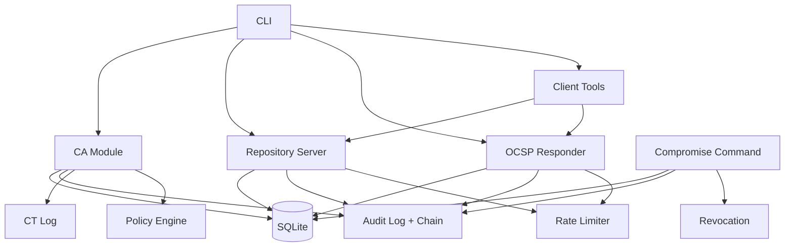

# MicroPKI

Учебный проект по созданию минимальной, но полной инфраструктуры публичных ключей (PKI).  
Реализован на Python с использованием библиотеки `cryptography` (версия 48.0.0) и `asn1crypto` (1.5.1).

## Возможности

- Корневой и промежуточный центры сертификации (RSA/ECC)
- Выпуск сертификатов по шаблонам: `server`, `client`, `code_signing`, `ocsp_signer`
- Subject Alternative Names (DNS, IP, email, URI)
- Проверка цепочки сертификатов (собственный валидатор RFC 5280)
- Отзыв сертификатов и генерация CRL (Certificate Revocation List) с поддержкой причин
- OCSP-ответчик (RFC 6960) с nonce и кэшированием
- HTTP-репозиторий для выдачи сертификатов, CRL и OCSP-ответов
- Полноценная база данных SQLite с уникальными серийными номерами
- Клиентские инструменты: генерация CSR, запрос сертификата, проверка цепочки и статуса (OCSP/CRL fallback)
- Поддержка CDP (CRL Distribution Points) и AIA (Authority Information Access) – автоматическое извлечение OCSP и CRL из сертификата
- **Аудит с криптографической целостностью** – журнал событий в формате NDJSON с SHA-256 хеш-цепочкой, команды `audit query` и `audit verify`.
- **Принуждение политик безопасности** – проверка минимальных размеров ключей, максимальных сроков действия, запрет wildcard SAN, ограничения типов SAN по шаблонам.
- **Rate limiting** – защита репозитория и OCSP-ответчика от чрезмерных запросов (опционально).
- **Certificate Transparency симуляция** – простой дополняемый лог всех выпущенных сертификатов.
- **Компрометация ключей** – команда `ca compromise` для отзыва и блокировки скомпрометированных ключей.

## Архитектура



## Структура проекта

```
micropki/
├── micropki/              # Основной пакет
│   ├── __init__.py
│   ├── __main__.py
│   ├── cli.py             # Парсер командной строки
│   ├── ca.py              # Логика CA (инициализация, выпуск, цепочки)
│   ├── certificates.py    # Создание X.509 сертификатов, CSR, шаблоны, SAN
│   ├── crl.py             # Генерация CRL
│   ├── revocation.py      # Отзыв сертификатов
│   ├── crypto_utils.py    # Генерация и шифрование ключей
│   ├── database.py        # Работа с SQLite (схема, миграции)
│   ├── repository.py      # HTTP репозиторий (Flask)
│   ├── ocsp.py            # Парсинг и формирование OCSP-запросов/ответов
│   ├── ocsp_responder.py  # Flask‑приложение OCSP-ответчика с кэшированием
│   ├── logger.py          # Настройка логирования
│   ├── client.py          # Клиентские утилиты (gen-csr, request-cert, validate, check-status)
│   ├── revocation_check.py# Извлечение AIA/CDP, OCSP- и CRL-клиенты
│   ├── audit.py           # Аудит с криптографической целостностью (Sprint 7)
│   ├── ratelimit.py       # Token bucket rate limiter (Sprint 7)
│   ├── config.py          # Конфигурация (YAML) + политики безопасности
├── tests/                 # Модульные тесты (pytest)
├── requirements.txt
├── setup.py
├── pytest.ini
└── README.md
```

## Требования

- Python 3.8 или выше
- Библиотеки: `cryptography>=42.0.0`, `asn1crypto>=1.5.0`, `Flask>=2.0`, `pytest>=6.0`, `pyyaml>=6.0`, `requests>=2.25.0`
- OpenSSL (для проверки CRL и OCSP, опционально)

## Установка

1. Клонируйте репозиторий и перейдите в папку проекта:
   ```bash
   git clone <url>
   cd micropki
   ```

2. Создайте виртуальное окружение:
   ```bash
   python -m venv .venv
   .venv\Scripts\activate      # Windows
   # source .venv/bin/activate   # Linux/macOS
   ```

3. Установите пакет в режиме разработки:
   ```bash
   pip install -e .
   ```

## Использование

### 1. Инициализация корневого CA (Root)

Создайте файл с парольной фразой (например, `pass.txt`):
```bash
echo "mysecret" > pass.txt
```

Выполните команду:
```bash
micropki ca init \
    --subject "/CN=My Root CA" \
    --key-type rsa \
    --key-size 4096 \
    --passphrase-file pass.txt \
    --out-dir ./pki \
    --validity-days 3650 \
    --force
```

После выполнения в директории `pki` появятся:
- `private/ca.key.pem` – зашифрованный приватный ключ (PEM, PKCS#8)
- `certs/ca.cert.pem` – самоподписанный сертификат
- `policy.txt` – текстовый документ политики CA
- `crl/` – директория для будущих CRL

Проверка с помощью OpenSSL:
```bash
openssl x509 -in pki/certs/ca.cert.pem -text -noout
openssl verify -CAfile pki/certs/ca.cert.pem pki/certs/ca.cert.pem
```

### 2. Создание промежуточного CA (Intermediate)

```bash
echo "intsecret" > int_pass.txt

micropki ca issue-intermediate \
    --root-cert ./pki/certs/ca.cert.pem \
    --root-key ./pki/private/ca.key.pem \
    --root-pass-file pass.txt \
    --subject "CN=MicroPKI Intermediate CA" \
    --key-type rsa \
    --key-size 4096 \
    --passphrase-file int_pass.txt \
    --out-dir ./pki \
    --validity-days 1825 \
    --pathlen 0 \
    --crl-url "http://localhost:8080/crl?ca=intermediate" \
    --ocsp-url "http://localhost:8081/ocsp" \
    --force
```

Будут созданы:
- `pki/private/intermediate.key.pem` (зашифрован)
- `pki/certs/intermediate.cert.pem` (содержит CDP и AIA расширения)

### 3. Выпуск конечных сертификатов (end-entity)

#### Сертификат сервера (с DNS и IP SAN, с CDP/AIA)
```bash
micropki ca issue-cert \
    --ca-cert ./pki/certs/intermediate.cert.pem \
    --ca-key ./pki/private/intermediate.key.pem \
    --ca-pass-file int_pass.txt \
    --template server \
    --subject "CN=example.com" \
    --san dns:example.com \
    --san dns:www.example.com \
    --san ip:192.168.1.10 \
    --crl-url "http://localhost:8080/crl?ca=intermediate" \
    --ocsp-url "http://localhost:8081/ocsp" \
    --out-dir ./certs \
    --validity-days 365 \
    --force
```
Результат: `certs/example.com.cert.pem` и `certs/example.com.key.pem` (незашифрованный). Сертификат будет содержать CDP и AIA.

#### Клиентский сертификат
```bash
micropki ca issue-cert \
    --ca-cert ./pki/certs/intermediate.cert.pem \
    --ca-key ./pki/private/intermediate.key.pem \
    --ca-pass-file int_pass.txt \
    --template client \
    --subject "CN=Alice Smith,EMAIL=alice@example.com" \
    --san email:alice@example.com \
    --out-dir ./certs \
    --force
```

#### Сертификат для подписи кода
```bash
micropki ca issue-cert \
    --ca-cert ./pki/certs/intermediate.cert.pem \
    --ca-key ./pki/private/intermediate.key.pem \
    --ca-pass-file int_pass.txt \
    --template code_signing \
    --subject "CN=MicroPKI Code Signer" \
    --out-dir ./certs \
    --force
```

### 4. Отзыв сертификата

```bash
# Отозвать сертификат по серийному номеру
micropki ca revoke 0x2A7F... --reason keyCompromise

# С указанием причины и без подтверждения
micropki ca revoke 0x3B8E... --reason superseded --force
```

Поддерживаемые причины отзыва: `unspecified`, `keyCompromise`, `cACompromise`, `affiliationChanged`, `superseded`, `cessationOfOperation`, `certificateHold`, `removeFromCRL`, `privilegeWithdrawn`, `aACompromise`.

### 5. Генерация CRL

```bash
# CRL для промежуточного CA (срок действия 14 дней)
micropki ca gen-crl --ca intermediate --next-update 14 --ca-pass-file int_pass.txt --force

# CRL для корневого CA (7 дней)
micropki ca gen-crl --ca root --next-update 7 --ca-pass-file pass.txt --force
```

CRL сохраняются в `pki/crl/` как `root.crl.pem` и `intermediate.crl.pem`.

### 6. Проверка статуса отзыва (через БД)

```bash
micropki ca check-revoked 0x2A7F...
```

### 7. Проверка цепочки сертификатов (встроенная)

```bash
micropki ca verify-chain \
    --leaf ./certs/example.com.cert.pem \
    --intermediate ./pki/certs/intermediate.cert.pem \
    --root ./pki/certs/ca.cert.pem
```

### 8. OCSP‑ответчик (Online Certificate Status Protocol)

#### Выпуск сертификата для OCSP‑подписи

```bash
micropki ca issue-ocsp-cert \
    --ca-cert ./pki/certs/intermediate.cert.pem \
    --ca-key ./pki/private/intermediate.key.pem \
    --ca-pass-file int_pass.txt \
    --subject "CN=OCSP Responder" \
    --key-type rsa --key-size 2048 \
    --out-dir ./pki/certs \
    --force
```

#### Запуск OCSP‑сервера

```bash
micropki ocsp serve \
    --host 127.0.0.1 --port 8081 \
    --db-path ./pki/micropki.db \
    --responder-cert ./pki/certs/OCSP_Responder.cert.pem \
    --responder-key ./pki/certs/OCSP_Responder.key.pem \
    --ca-cert ./pki/certs/intermediate.cert.pem \
    --cache-ttl 120 \
    --log-file ./logs/ocsp.log
```

#### Проверка OCSP с помощью OpenSSL

```bash
openssl ocsp -issuer pki/certs/intermediate.cert.pem \
    -cert certs/example.com.cert.pem \
    -url http://127.0.0.1:8081/ocsp \
    -CAfile pki/certs/ca.cert.pem \
    -resp_text -no_nonce
```

### 9. Управление базой данных сертификатов

#### Инициализация базы данных

```bash
micropki db init --out-dir ./pki
```

#### Просмотр списка сертификатов

```bash
micropki ca list-certs
micropki ca list-certs --status valid
micropki ca list-certs --format json
micropki ca list-certs --format csv
```

#### Просмотр конкретного сертификата по серийному номеру

```bash
micropki ca show-cert 0x6521745cca871a45325873c792719
```

### 10. HTTP репозиторий

#### Запуск сервера (с поддержкой подписи и CDP/AIA)

```bash
micropki repo serve \
    --host 127.0.0.1 --port 8080 \
    --out-dir ./pki \
    --ca-cert ./pki/certs/intermediate.cert.pem \
    --ca-key ./pki/private/intermediate.key.pem \
    --ca-pass-file int_pass.txt \
    --crl-url "http://localhost:8080/crl?ca=intermediate" \
    --ocsp-url "http://localhost:8081/ocsp"
```

#### Примеры запросов

```bash
# Получить сертификат по серийному номеру
curl http://127.0.0.1:8080/certificate/0x6521745cca871a45325873c792719

# Получить корневой сертификат
curl http://127.0.0.1:8080/ca/root

# Получить промежуточный сертификат
curl http://127.0.0.1:8080/ca/intermediate

# Получить CRL (по умолчанию intermediate)
curl http://127.0.0.1:8080/crl

# Получить CRL корневого CA
curl http://127.0.0.1:8080/crl?ca=root

# Альтернативный путь
curl http://127.0.0.1:8080/crl/root.crl

# Отправить CSR на подпись (через клиентскую команду)
micropki client request-cert --csr request.csr --template server --ca-url http://127.0.0.1:8080 --out-cert cert.pem
```

### 11. Клиентские инструменты (Sprint 6)

#### Генерация ключа и CSR

```bash
micropki client gen-csr \
    --subject "CN=app.example.com" \
    --key-type rsa --key-size 2048 \
    --san dns:app.example.com \
    --out-key app.key --out-csr app.csr
```

#### Отправка CSR в репозиторий и получение сертификата

```bash
micropki client request-cert \
    --csr app.csr --template server \
    --ca-url http://127.0.0.1:8080 --out-cert app.cert
```

#### Проверка цепочки и статуса отзыва (OCSP/CRL fallback)

```bash
# Полная проверка (цепочка + отзыв)
micropki client validate \
    --cert app.cert \
    --trusted pki/certs/ca.cert.pem \
    --untrusted pki/certs/intermediate.cert.pem \
    --mode full

# Только статус отзыва (OCSP → CRL fallback)
micropki client check-status --cert app.cert --ca-cert pki/certs/intermediate.cert.pem
```

### 12. Аудит и целостность (Sprint 7)

MicroPKI ведёт детальный журнал всех критических операций с гарантией целостности (хеш-цепочка SHA-256).

#### Просмотр аудит-лога

```bash
# Вывести все записи
micropki audit query

# Фильтрация по времени, уровню, операции
micropki audit query --from 2026-06-01T00:00:00Z --level AUDIT --operation issue_certificate

# Вывод в JSON или CSV
micropki audit query --format json

# Проверить целостность отдельных записей
micropki audit query --verify
```

#### Проверка целостности всего лога

```bash
micropki audit verify
```

При повреждении лога (изменении, удалении, вставке) команда укажет номер первой испорченной строки.

### 13. Политики безопасности (Sprint 7)

CA принудительно применяет следующие ограничения:

| Политика | Ограничение |
|----------|-------------|
| Максимальный срок действия | Root: 10 лет, Intermediate: 5 лет, End-entity: 1 год |
| Минимальный размер ключа RSA | Root: 4096, Intermediate: 3072, End-entity: 2048 |
| Минимальный размер ключа ECC | Root/Intermediate: 384, End-entity: 256 |
| Запрет wildcard в SAN | Для серверных сертификатов (по умолчанию) |
| Разрешённые типы SAN | server: dns, ip; client: email, dns; code_signing: dns, uri |

При нарушении любой политики выдача сертификата блокируется, а в аудит-лог добавляется запись с уровнем `ERROR`.

### 14. Rate limiting (Sprint 7)

Для защиты от злоупотреблений репозиторий и OCSP-ответчик поддерживают ограничение частоты запросов с одного IP (token bucket).

```bash
# Запуск репозитория с лимитом 5 запросов/сек, burst 10
micropki repo serve --rate-limit 5 --rate-burst 10 ...

# Запуск OCSP-ответчика с лимитом 10 запросов/сек, burst 20
micropki ocsp serve --rate-limit 10 --rate-burst 20 ...
```

При превышении лимита сервер возвращает HTTP 429 `Too Many Requests` с заголовком `Retry-After`.

### 15. Certificate Transparency симуляция (Sprint 7)

Все выпущенные сертификаты записываются в файл `pki/audit/ct.log` в формате:

```
<timestamp> <serial_hex> <subject> <SHA-256 fingerprint>
```

Это позволяет проверить факт выпуска сертификата (например, `grep 0x2A7F... ct.log`).

### 16. Компрометация ключа (Sprint 7)

При компрометации приватного ключа сертификат должен быть немедленно отозван, а ключ заблокирован.

```bash
# Отметить сертификат как скомпрометированный
micropki ca compromise --cert ./pki/certs/example.com.cert.pem --reason keyCompromise
```

**Что происходит:**
1. Сертификат отзывается с указанной причиной.
2. Хеш публичного ключа (SHA-256 от SPKI) сохраняется в таблице `compromised_keys`.
3. Экстренно генерируется CRL для соответствующего CA.
4. Событие записывается в аудит-лог.

**Блокировка повторного использования:** если CSR содержит публичный ключ из `compromised_keys`, CA отклонит запрос с ошибкой:
```
The public key has been compromised and is blocked. Issuance rejected.
```


## Демонстрация работы (Sprint 8)

MicroPKI включает автоматический демонстрационный скрипт `demo/demo.py`, который выполняет полный цикл:

1. Инициализация корневого и промежуточного центров сертификации.
2. Выпуск OCSP-сертификата.
3. Выпуск сертификата для TLS-сервера (с поддержкой SAN `ip:127.0.0.1` и `dns:localhost`).
4. Запуск временного HTTPS-сервера (Python + SSL) и успешное TLS-соединение.
5. Отзыв сертификата и проверка статуса через БД (команда `ca check-revoked`).
6. Демонстрация клиентских инструментов (`client gen-csr`, `client request-cert`).
7. Подпись и проверка кода с использованием OpenSSL.
8. Проверка целостности аудит-лога (хеш-цепочка).

### Запуск демо

```bash
# Клонируйте репозиторий и установите пакет
git clone <url>
cd micropki
pip install -e .

# Запустите демонстрационный скрипт
python demo/demo.py
```

Скрипт создаст временную директорию со всеми артефактами PKI (ключи, сертификаты, CRL, база данных, аудит-лог). После успешного завершения будет предложено удалить временные файлы или оставить для анализа.


### Примечания по безопасности демо

- Все временные файлы создаются в системе (`%TEMP%` или `/tmp`) и удаляются после завершения скрипта (по запросу).
- Приватные ключи конечных сущностей хранятся незашифрованными (только для демонстрации). В реальном использовании рекомендуется шифрование.
- OCSP-ответчик запускается на порту 8081, репозиторий – на 8080. Убедитесь, что эти порты свободны перед запуском демо.
```


## Параметры команд

### `ca init` (Sprint 1)

| Аргумент | Описание | Пример |
|----------|----------|--------|
| `--subject` | Distinguished Name (DN) в формате `/CN=...` или `CN=...,O=...` | `/CN=My Root CA` |
| `--key-type` | Тип ключа: `rsa` или `ecc` (по умолчанию `rsa`) | `ecc` |
| `--key-size` | Размер ключа: для RSA – 4096, для ECC – 384 (по умолчанию 4096) | `4096` |
| `--passphrase-file` | Путь к файлу с парольной фразой для шифрования ключа | `./secrets/pass.txt` |
| `--out-dir` | Директория для вывода (по умолчанию `./pki`) | `./pki` |
| `--validity-days` | Срок действия сертификата в днях (по умолчанию 3650) | `7300` |
| `--log-file` | Путь к файлу лога (если не указан – логи в stderr) | `./logs/ca-init.log` |
| `--force` | Перезаписывать существующие файлы | `--force` |

### `ca issue-intermediate` (Sprint 2 + Sprint 6 CDP/AIA)

| Аргумент | Описание | Пример |
|----------|----------|--------|
| `--root-cert` | Путь к сертификату корневого CA (PEM) | `./pki/certs/ca.cert.pem` |
| `--root-key` | Путь к зашифрованному ключу корневого CA (PEM) | `./pki/private/ca.key.pem` |
| `--root-pass-file` | Файл с парольной фразой для ключа корневого CA | `./pass.txt` |
| `--subject` | Distinguished Name для промежуточного CA | `CN=Intermediate CA,O=MicroPKI` |
| `--key-type` | Тип ключа: `rsa` (4096) или `ecc` (384) | `rsa` |
| `--key-size` | Размер ключа (должен соответствовать типу) | `4096` |
| `--passphrase-file` | Файл с парольной фразой для ключа промежуточного CA | `./int_pass.txt` |
| `--out-dir` | Директория для вывода (по умолчанию `./pki`) | `./pki` |
| `--validity-days` | Срок действия сертификата (по умолчанию 1825) | `1825` |
| `--pathlen` | Ограничение длины цепочки (по умолчанию `0`) | `0` |
| `--crl-url` | **CRL Distribution Point URL** (можно указать несколько) | `--crl-url "http://localhost:8080/crl?ca=intermediate"` |
| `--ocsp-url` | **OCSP responder URL** для AIA расширения | `--ocsp-url "http://localhost:8081/ocsp"` |
| `--log-file` | Путь к файлу лога | `./logs/intermediate.log` |
| `--force` | Перезаписывать существующие файлы | `--force` |

### `ca issue-cert` (Sprint 2 + Sprint 6 CDP/AIA)

| Аргумент | Описание | Пример |
|----------|----------|--------|
| `--ca-cert` | Путь к сертификату CA (промежуточного или корневого) | `./pki/certs/intermediate.cert.pem` |
| `--ca-key` | Путь к зашифрованному ключу CA | `./pki/private/intermediate.key.pem` |
| `--ca-pass-file` | Файл с парольной фразой для ключа CA | `./int_pass.txt` |
| `--template` | Тип сертификата: `server`, `client`, `code_signing` | `server` |
| `--subject` | Distinguished Name для конечного сертификата | `CN=example.com` |
| `--san` | Subject Alternative Name (можно указать несколько) | `dns:example.com` `ip:192.168.1.1` |
| `--csr` | (Опционально) Внешний CSR в формате PEM | `./request.csr` |
| `--crl-url` | **CRL Distribution Point URL** (можно указать несколько) | `--crl-url "http://localhost:8080/crl?ca=intermediate"` |
| `--ocsp-url` | **OCSP responder URL** для AIA расширения | `--ocsp-url "http://localhost:8081/ocsp"` |
| `--out-dir` | Директория для вывода (по умолчанию `./pki/certs`) | `./certs` |
| `--validity-days` | Срок действия сертификата (по умолчанию 365) | `365` |
| `--log-file` | Путь к файлу лога | `./logs/issue.log` |
| `--force` | Перезаписывать существующие файлы | `--force` |

### `ca revoke` (Sprint 4)

| Аргумент | Описание | Пример |
|----------|----------|--------|
| `serial` | Серийный номер сертификата (шестнадцатеричный) | `0x2A7F...` |
| `--reason` | Причина отзыва (по умолчанию `unspecified`) | `keyCompromise` |
| `--force` | Пропустить подтверждение | `--force` |
| `--pki-dir` | Корневая директория PKI (по умолчанию `./pki`) | `./pki` |
| `--log-file` | Путь к файлу лога | `./logs/revoke.log` |

### `ca gen-crl` (Sprint 4)

| Аргумент | Описание | Пример |
|----------|----------|--------|
| `--ca` | Какой CA: `root` или `intermediate` | `root` |
| `--next-update` | Дней до следующего обновления CRL (по умолчанию 7) | `14` |
| `--out-file` | Путь для сохранения CRL (опционально) | `./custom.crl.pem` |
| `--ca-pass-file` | Файл с парольной фразой для ключа CA | `pass.txt` |
| `--pki-dir` | Корневая директория PKI (по умолчанию `./pki`) | `./pki` |
| `--force` | Перезаписывать существующий CRL | `--force` |

### `ca check-revoked` (Sprint 4)

| Аргумент | Описание | Пример |
|----------|----------|--------|
| `serial` | Серийный номер сертификата (шестнадцатеричный) | `0x2A7F...` |
| `--pki-dir` | Корневая директория PKI (по умолчанию `./pki`) | `./pki` |

### `ca verify-chain` (Sprint 2)

| Аргумент | Описание | Пример |
|----------|----------|--------|
| `--leaf` | Путь к конечному сертификату (PEM) | `./certs/example.com.cert.pem` |
| `--intermediate` | (Опционально) Путь к сертификату промежуточного CA | `./pki/certs/intermediate.cert.pem` |
| `--root` | Путь к сертификату корневого CA | `./pki/certs/ca.cert.pem` |

### `ca verify` (Sprint 1)

| Аргумент | Описание | Пример |
|----------|----------|--------|
| `--cert` | Путь к сертификату для проверки (только самоподписанный) | `./pki/certs/ca.cert.pem` |

### `client gen-csr` (Sprint 6)

| Аргумент | Описание | Пример |
|----------|----------|--------|
| `--subject` | Distinguished Name | `CN=client.example.com` |
| `--key-type` | `rsa` или `ecc` (по умолчанию `rsa`) | `ecc` |
| `--key-size` | Размер ключа: RSA 2048/4096, ECC 256/384 | `2048` |
| `--san` | Subject Alternative Name (можно несколько) | `dns:example.com` `ip:10.0.0.1` |
| `--out-key` | Файл для сохранения приватного ключа | `./client.key` |
| `--out-csr` | Файл для сохранения CSR | `./client.csr` |
| `--force` | Перезаписывать существующие файлы | `--force` |

### `client request-cert` (Sprint 6)

| Аргумент | Описание | Пример |
|----------|----------|--------|
| `--csr` | Путь к CSR файлу | `./client.csr` |
| `--template` | Шаблон сертификата (`server`, `client`, `code_signing`) | `server` |
| `--ca-url` | Базовый URL репозитория | `http://localhost:8080` |
| `--out-cert` | Файл для сохранения сертификата | `./client.cert` |
| `--force` | Перезаписывать существующий файл | `--force` |

### `client validate` (Sprint 6)

| Аргумент | Описание | Пример |
|----------|----------|--------|
| `--cert` | Путь к проверяемому сертификату | `./client.cert` |
| `--untrusted` | Путь к промежуточному сертификату (можно несколько) | `--untrusted intermediate.pem` |
| `--trusted` | Путь к корневому сертификату (по умолч. `./pki/certs/ca.cert.pem`) | `./root.pem` |
| `--crl` | CRL файл или URL (опционально) | `--crl http://localhost:8080/crl` |
| `--ocsp` | Выполнить OCSP-проверку | `--ocsp` |
| `--mode` | `chain` (только цепочка) или `full` (с отзывом) | `full` |

### `client check-status` (Sprint 6)

| Аргумент | Описание | Пример |
|----------|----------|--------|
| `--cert` | Путь к сертификату | `./client.cert` |
| `--ca-cert` | Путь к сертификату издателя (CA) | `./pki/certs/intermediate.cert.pem` |
| `--crl` | CRL файл или URL (опционально) | `--crl http://localhost:8080/crl` |
| `--ocsp-url` | OCSP URL (переопределяет AIA) | `--ocsp-url http://localhost:8081/ocsp` |

### `repo serve` (Sprint 3 + Sprint 6)

| Аргумент | Описание | Пример |
|----------|----------|--------|
| `--host` | Адрес для привязки | `127.0.0.1` |
| `--port` | TCP порт | `8080` |
| `--out-dir` | Корневая директория PKI (по умолч. `./pki`) | `./pki` |
| `--log-file` | Файл лога HTTP запросов | `./logs/repo.log` |
| `--log-format` | `text` или `json` | `json` |
| `--ca-cert` | Сертификат CA для онлайн-подписи | `./pki/certs/intermediate.cert.pem` |
| `--ca-key` | Приватный ключ CA | `./pki/private/intermediate.key.pem` |
| `--ca-pass-file` | Файл с парольной фразой для ключа CA | `./int_pass.txt` |
| `--crl-url` | **CRL URL по умолчанию** (добавляется в сертификаты) | `http://localhost:8080/crl?ca=intermediate` |
| `--ocsp-url` | **OCSP URL по умолчанию** (AIA) | `http://localhost:8081/ocsp` |
| `--rate-limit` | Запросов в секунду на IP (0 – отключено) | `5` |
| `--rate-burst` | Burst allowance | `10` |

### `ocsp serve` (Sprint 5 + Sprint 7 rate limiting)

| Аргумент | Описание | Пример |
|----------|----------|--------|
| `--host` | Адрес для привязки | `127.0.0.1` |
| `--port` | TCP порт | `8081` |
| `--db-path` | Путь к SQLite базе | `./pki/micropki.db` |
| `--responder-cert` | Сертификат для подписи OCSP | `./pki/certs/OCSP_Responder.cert.pem` |
| `--responder-key` | Приватный ключ (незашифрованный) | `./pki/certs/OCSP_Responder.key.pem` |
| `--ca-cert` | Сертификат издателя (CA) | `./pki/certs/intermediate.cert.pem` |
| `--cache-ttl` | Время жизни кэша в секундах | `120` |
| `--log-file` | Файл лога OCSP запросов | `./logs/ocsp.log` |
| `--rate-limit` | Запросов в секунду на IP | `10` |
| `--rate-burst` | Burst allowance | `20` |

### `audit query` (Sprint 7)

| Аргумент | Описание | Пример |
|----------|----------|--------|
| `--from` | Начальная временная метка (ISO 8601) | `2026-06-01T00:00:00Z` |
| `--to` | Конечная временная метка | `2026-06-07T23:59:59Z` |
| `--level` | Уровень логирования (`INFO`, `WARNING`, `ERROR`, `AUDIT`) | `AUDIT` |
| `--operation` | Тип операции (`issue_certificate`, `revoke`, ...) | `issue_certificate` |
| `--serial` | Серийный номер сертификата | `0x2A7F...` |
| `--format` | Формат вывода (`table`, `json`, `csv`) | `json` |
| `--verify` | Проверить целостность отобранных записей | `--verify` |
| `--audit-dir` | Директория с аудит-логом (по умолчанию `./pki/audit`) | `./pki/audit` |

### `audit verify` (Sprint 7)

| Аргумент | Описание | Пример |
|----------|----------|--------|
| `--audit-dir` | Директория с аудит-логом | `./pki/audit` |

### `ca compromise` (Sprint 7)

| Аргумент | Описание | Пример |
|----------|----------|--------|
| `--cert` | Путь к сертификату (PEM) | `./certs/example.com.cert.pem` |
| `--reason` | Причина отзыва (по умолчанию `keyCompromise`) | `keyCompromise` |
| `--force` | Пропустить подтверждение | `--force` |
| `--pki-dir` | Корневая директория PKI | `./pki` |
| `--log-file` | Файл лога | `./logs/compromise.log` |

## Конфигурационный файл

MicroPKI поддерживает файл `micropki.conf` в формате YAML. Пример:

```yaml
pki_dir: ./pki
host: 0.0.0.0
port: 8080
log_level: INFO
```

Параметры, заданные в командной строке, имеют приоритет над конфигурационным файлом.

Политики безопасности можно переопределить в том же файле, добавив секцию `policy` (см. `config.py`).

## Проверка статуса репозитория
```bash
micropki repo status
```
Выводит, запущен ли HTTP сервер на указанном (или настроенном) хосте и порту.

## Примечания по безопасности

- Приватные ключи корневого и промежуточного CA хранятся в зашифрованном виде (AES-256).
- Ключи конечных сущностей сохраняются незашифрованными с правами `600`. Будьте внимательны с их хранением.
- Парольные фразы не выводятся в логах.
- На Unix-системах для директории `private` устанавливаются права `700`.
- OCSP-сертификат используется для подписи ответов, его приватный ключ хранится **незашифрованным** (требование автоматического запуска). Убедитесь в безопасности файловой системы.
- **Аудит-лог защищён хеш-цепочкой**: любое изменение будет обнаружено командой `audit verify`.
- **Rate limiting** помогает защитить API от грубых атак, но не является полноценным WAF.
- **Скомпрометированные ключи** блокируются навсегда; ведите отдельный учёт вне PKI.

## Известные ограничения

- OCSP-ответчик возвращает `404 Not Found` для неизвестных сертификатов вместо `unknown` (допустимо, RFC не требует строгого поведения).
- Кэширование OCSP не учитывает изменения статуса до истечения TTL (при необходимости можно обновить CRL/OCSP вручную).
- Delta‑CRL не реализованы (только полные CRL).
- Rate limiting тест может быть нестабилен на Windows из-за низкого разрешения таймеров, но сама функциональность работает корректно.

## Запуск тестов

```bash
pip install -e .[test]   # или просто pip install pytest pytest-cov
pytest tests/ -v
